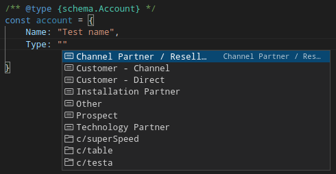
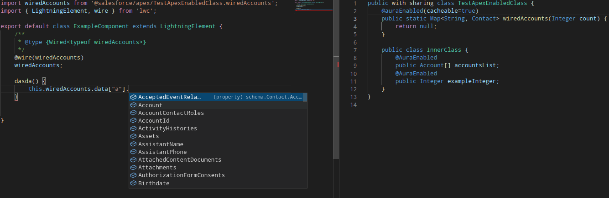
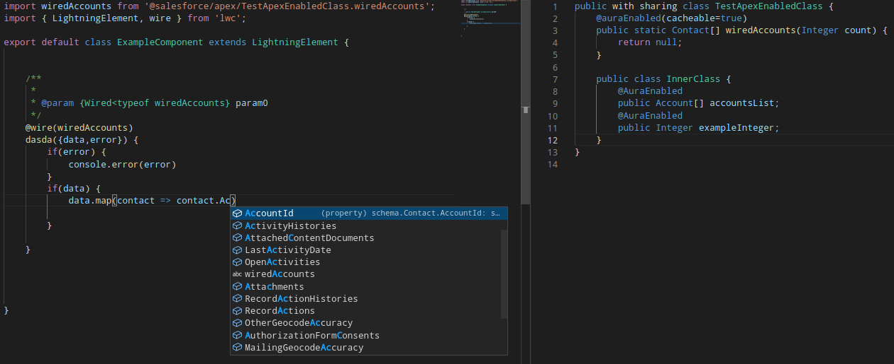

# Lwc typings generation

Experimental plugin for better LWC typings using [my unfinished treesitter parser for apex ](https://github.com/Ziemniakoss/tree-sitter-apex).
Works on linux, should work on Mac and Windows as it only uses js and wasm, but I can't verify this.







## How to install?

```
sfdx plugins:install lwc-typings-generator
```

## How to use?

For full instruction how to use, please see [wiki of this project](https://github.com/Ziemniakoss/lwc-typings-generator/wiki).

## How to go back?

If for some reason you would want to go back to old typings, just delete jsconfig.json files in your project and delete folder

```
.sfdx/lwc-typings
```

## TODO

- https://developer.salesforce.com/docs/component-library/documentation/en/lwc/lwc.reference_salesforce_modules
- message channels
- static resources
- internationalization
- perrmissions
