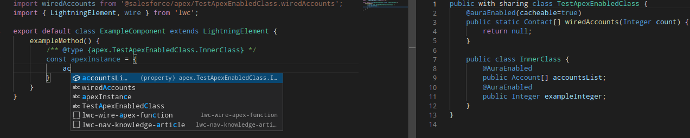

# Lwc typings generation

Experimental plugin for better LWC typings using [my unfinished treesitter parser for apex ](https://github.com/Ziemniakoss/tree-sitter-apex).
Works on linux, should work on Mac and Windows as it only uses js and wasm, but I can't verify this.

## How to install?

```
sfdx plugins:install lwc-typings-generator
```

## How to use?

### Generate standard library

```
sfdx typings:lwc:stdlib
```

Run this command:
- on first install
- on every update of plugin (updates might improve exisiting typings or add typings for new functions)
- after creation/deletion of lwc component (this will regenerate typings for lwc.template.query)

### Generate SObject typings

```
sfdx typings:lwc:sobject -s Account,CustomObject__c,Contact,AnyOtherSObjectThatYouWantToGenereateTypingsFor__c
```
Run this command:
- when you want to add typings for new SObject
- when data model changes
- when permissions to fields change

### Generate labels typings

```
sfdx typings:lwc:labels
```

Run this command:
- after install
- when you add new label to org

### Generate jsconfig.js

```
sfdx typings:lwc:jsconfig
```

Run this command:
- when you create/delete/move to other folder lwc component

### Generate apex typings

```
sfdx typings:lwc:apex
```

Run this comman:
- after creation/deletion/modification of apex class

### Using SObject interfaces

All SObject interfaces are included in "schema" namespace.
After you generate typings for SObject using "typings:lwc:sobject" command, you can reference SObject interfaces:

```js
/** @type {schema.Account} */
const acoount = {
    Name :"Test name"
}
```


This command will also generate some additional types like:
```js
/** @type {schema.Account__RecordType__DevName} */
const accountRecordTypeDevName = "Boss"
```

Some other useful types:
```js
// Type of field, in this example it is picklist
/** @type {schema.Account["Type"]} */
const picklistType = "Prospect"

/** @type {keyof schema.Account}*/
const fieldApiName = "BillingCity"
```

### Using apex wired methods typings

Now wired methods have proper typings! Wow!

This plugin also introduces special type, Wired. It is meant to be used on properties and methods that use wire decorator.
Example usage:
```js
/** @type {Wired<typeof apexWiredMethod> */
```


### Using apex typings

After runnung command
```
sfdx typings:lwc:apex
```
all classes (regardless if they have aura enablde properties) have generated type in "apex" namespace.



## How to go back?

If for some reason you would want to go back to old typings, just delete jsconfig.json files in your project and delete folder
```
.sfdx/lwc-typings
```

## TODO

- https://developer.salesforce.com/docs/component-library/documentation/en/lwc/lwc.reference_salesforce_modules
- message channels
- static resources
- internationalization
- perrmissions

https://developer.salesforce.com/docs/component-library/documentation/en/lwc/lwc.use_barcodescanner
